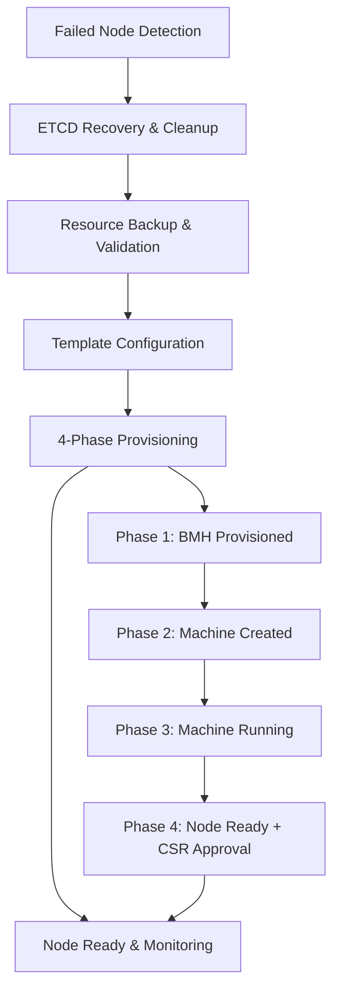

# OpenShift Control Plane Replacement Tool

**NOTE:** README Generated by Cursor.ai

A comprehensive automation solution for OpenShift cluster node management, supporting **control plane replacement**, **control plane expansion**, and **worker node addition** operations on bare metal OpenShift 4.x clusters.

## ✨ Features

### 🎯 Operation Modes
- **🔄 Control Plane Replacement** - Replace failed control plane nodes (default mode)
- **📈 Control Plane Expansion** - Add new control plane nodes to increase cluster resilience
- **👷 Worker Node Addition** - Add worker nodes to expand cluster capacity

### 🚀 Core Capabilities
- **Automated ETCD Management** - Safe member removal, quorum guard handling, and cluster recovery
- **Smart Resource Management** - Intelligent backup, templating, and configuration from existing cluster resources  
- **4-Phase Provisioning** - BMH → Machine → Node → Ready with comprehensive monitoring
- **CSR Auto-Approval** - Automatic certificate approval after configurable threshold (10 minutes)
- **Retry Logic** - Robust retry mechanism for API calls with exponential backoff

### 🛡️ Safety & Reliability Features  
- **Quorum Guard Management** - Automatic disable/enable with verification for ETCD safety
- **Resource Validation** - Confirms successful resource cleanup before proceeding
- **Comprehensive Backups** - Preserves BMH, Machine, Secret, and network configurations
- **Failed Node Detection** - Automatically identifies failed control plane nodes
- **Template Selection** - Intelligent selection of control plane vs worker templates

### 📊 Monitoring & Observability
- **Real-time Progress** - Step-by-step status with detailed timing information
- **4-Phase Status Tracking** - Visual indicators for each provisioning phase
- **Debug Mode** - Comprehensive logging with command execution details
- **CSR Status Monitoring** - Real-time certificate signing request tracking
- **Success/Failure Reporting** - Clear outcome summaries with actionable next steps

### 🏗️ Architecture Options
- **Monolithic Script** - Single-file deployment (`replace_control_plane.py`)
- **Modular Architecture** - Maintainable component structure (`replace_control_plane_modular.py`)
- **Professional Testing** - Comprehensive pytest suite with 229 tests and 60% coverage

## 🏗️ Architecture Overview



## 📋 Prerequisites

### Required Software
- **Python 3.8+** with PyYAML support
- **OpenShift CLI (`oc`)** - Authenticated to target cluster with cluster-admin privileges
- **Network Access** - To BMC interfaces and cluster APIs

> [!NOTE]  
> The tool requires an active `oc` session with cluster-admin privileges. It uses `oc` commands rather than direct API calls for maximum compatibility across OpenShift versions.

### Supported Platforms
- **OpenShift 4.x** on bare metal infrastructure
- **Administration Hosts**: RHEL/CentOS/Fedora/Ubuntu  
- **BMC Hardware**: iDRAC, iLO, Libvirt + Sushy, Redfish-compatible systems

### Infrastructure Requirements
- **ETCD Quorum**: Healthy quorum (at least 2/3 members functional) for replacement operations
- **Replacement Hardware**: Available bare metal with BMC access
- **Network Connectivity**: BMC network access and cluster network integration
- **Storage**: Adequate space for backup files (typically 10-50MB per operation)

## 🚀 Quick Start

### 1. Installation

#### Option A: Direct Usage (Recommended)
```bash
<<<<<<< HEAD
git clone https://github.com/YOUR_USERNAME/k8s-tools.git
=======
git clone https://github.com/stratus-ss/k8s-tools.git
cd k8s-tools/openshift-related/replace_control_plane
```

#### Option B: Package Installation
```bash
# Install from package
pip install -e .

# Or install with development dependencies
pip install -e .[dev]
```

### 2. Basic Usage Examples

#### Control Plane Node Replacement (Default)
```bash
# Replace a failed control plane node
python3 replace_control_plane.py \
  --replacement_node "ocp-control4.example.com" \
  --replacement_node_ip "192.168.1.14" \
  --replacement_node_bmc_ip "192.168.100.14" \
  --replacement_node_mac_address "aa:bb:cc:dd:ee:f4" \
  --replacement_node_role "control" \
  --debug
```

#### Control Plane Expansion
```bash
# Add a new control plane node (4th control plane)
python3 replace_control_plane.py \
  --replacement_node "ocp-control4.example.com" \
  --replacement_node_ip "192.168.1.14" \
  --replacement_node_bmc_ip "192.168.100.14" \
  --replacement_node_mac_address "aa:bb:cc:dd:ee:f4" \
  --replacement_node_role "control" \
  --expand-control-plane \
  --debug
```

#### Worker Node Addition
```bash
# Add a new worker node
python3 replace_control_plane.py \
  --replacement_node "ocp-worker5.example.com" \
  --replacement_node_ip "192.168.1.25" \
  --replacement_node_bmc_ip "192.168.100.25" \
  --replacement_node_mac_address "aa:bb:cc:dd:ee:25" \
  --replacement_node_role "worker" \
  --add_new_node \
  --debug
```

## 📖 Comprehensive Usage Guide

### Command Line Arguments

| Argument | Required | Description | Example | Default |
|----------|----------|-------------|---------|---------|
| `--replacement_node` | ✅ | FQDN of replacement node | `ocp-control4.example.com` | - |
| `--replacement_node_ip` | ✅ | IP address for replacement | `192.168.1.14` | - |
| `--replacement_node_bmc_ip` | ✅ | BMC IP for hardware control | `192.168.100.14` | - |
| `--replacement_node_mac_address` | ✅ | Boot MAC address | `aa:bb:cc:dd:ee:f4` | - |
| `--replacement_node_role` | ✅ | Node role | `control`, `master`, `worker` | - |
| `--backup_dir` | ❌ | Custom backup directory | `/path/to/backups` | `~/backup_yamls/<cluster>` |
| `--sushy_uid` | ❌ | Redfish system UID override | `c4f5c-40d6-ad72-a3879c` | Auto-detected |
| `--debug` | ❌ | Enable detailed logging | - | `false` |
| `--skip-etcd` | ❌ | Skip ETCD operations | - | `false` |
| `--expand-control-plane` | ❌ | Control plane expansion mode | - | `false` |
| `--add_new_node` | ❌ | Worker node addition mode | - | `false` |

### Operation Modes

#### 🔄 Control Plane Replacement (Default Mode)
**Use Case**: Replace a failed control plane node that's in NotReady state
```bash
python3 replace_control_plane.py --replacement_node ... --replacement_node_role control
```

**Process**: 12-step comprehensive replacement including ETCD member removal, resource cleanup, and full provisioning.

#### 📈 Control Plane Expansion Mode
**Use Case**: Add additional control plane nodes for high availability (3→5 or 5→7)
```bash
python3 replace_control_plane.py --replacement_node ... --replacement_node_role control --expand-control-plane
```

**Process**: Adds new control plane node while maintaining existing ETCD cluster health.

#### 👷 Worker Node Addition Mode  
**Use Case**: Add worker nodes to increase cluster compute capacity
```bash
python3 replace_control_plane.py --replacement_node ... --replacement_node_role worker --add_new_node
```

**Process**: Simplified workflow focusing on BMH, Machine, and Secret creation without ETCD operations.

## 🔄 Process Overview

### Control Plane Replacement (12-Step Process)

#### Phase 1: Preparation & Discovery (Steps 1-3)
1. **Setup** - Initialize backup directory and validate configuration
2. **Discovery** - Automatically identify failed control plane node
3. **ETCD Recovery** - Remove failed member from ETCD cluster

#### Phase 2: Cluster Preparation (Steps 4-6)  
4. **Quorum Guard** - Temporarily disable ETCD quorum guard for safe operations
5. **Secret Cleanup** - Remove ETCD secrets associated with failed node
6. **Resource Backup** - Backup BMH, Machine, and network configurations

#### Phase 3: Resource Management (Steps 7-9)
7. **Resource Removal** - Clean removal of failed BMH and Machine resources
8. **Validation** - Confirm successful resource cleanup
9. **Configuration** - Create replacement node configurations from templates

#### Phase 4: Provisioning & Recovery (Steps 10-12)
10. **Deployment** - Apply secrets and BMH for replacement node
11. **4-Phase Monitoring** - Monitor BMH→Machine→Node→Ready progression
12. **Finalization** - Re-enable ETCD quorum guard and verify cluster health

### Control Plane Expansion (8-Step Process)

1. **Template Selection** - Choose appropriate control plane template
2. **Configuration Creation** - Generate new node configurations  
3. **Secret Deployment** - Apply BMC and network secrets
4. **BMH Creation** - Create and apply BareMetalHost
5. **4-Phase Monitoring** - Monitor provisioning progression
6. **ETCD Integration** - Add new member to ETCD cluster
7. **Quorum Guard** - Re-enable ETCD quorum guard
8. **Validation** - Verify cluster health and node readiness

### Worker Node Addition (6-Step Process)

1. **Template Selection** - Choose worker or adapted control plane template
2. **Configuration Creation** - Generate worker node configurations
3. **Secret Deployment** - Apply BMC and network secrets  
4. **BMH Creation** - Create and apply BareMetalHost
5. **Machine Creation** - Create Machine resource
6. **4-Phase Monitoring** - Monitor provisioning to Ready state

## 🏗️ Module Architecture

The tool is built with a modular architecture supporting both monolithic and component-based deployment:

### Core Modules

| Module | Lines | Purpose | Key Functions |
|--------|-------|---------|---------------|
| **utilities.py** | 1022 | Core utility functions | `execute_oc_command`, `find_node`, retry logic |
| **resource_manager.py** | 793 | Resource operations | Backup, removal, application |
| **orchestrator.py** | 639 | Workflow orchestration | `NodeOperationOrchestrator` class |
| **etcd_manager.py** | 475 | ETCD cluster management | Member removal, quorum guard |
| **resource_monitor.py** | 456 | 4-phase provisioning monitoring | `ResourceMonitor` class |
| **node_configurator.py** | 408 | Node configuration | YAML templating and updates |
| **backup_manager.py** | 398 | Resource backup operations | `BackupManager` class |
| **configuration_manager.py** | 313 | Template management | Configuration generation |
| **arguments_parser.py** | 91 | CLI argument parsing | `ArgumentsParser` class |
| **print_manager.py** | 51 | Output formatting | Progress reporting |

### Key Classes and Functions

#### BackupManager Class
```python
# Comprehensive backup operations
backup_manager = BackupManager(backup_dir, printer, execute_oc_command)
backup_manager.setup_backup_directory()
backup_manager.backup_bmh_definition(bmh_name, bmh_data)
backup_manager.backup_machine_definition(machine_name, machine_data)
backup_manager.backup_secret(node_name, "bmc-secret", "-bmc-secret.yaml", "BMC secret")
```

#### ResourceMonitor Class  
```python
# 4-phase provisioning monitoring
monitor = ResourceMonitor(replacement_node, backup_dir, timeout_minutes=45)
success = monitor.monitor_4_phase_provisioning()
```

#### ETCD Management Functions
```python
# ETCD operations with safety checks
handle_etcd_operations_for_replacement(args, dependencies)  # Replacement mode
handle_etcd_operations_for_expansion(args, dependencies)    # Expansion mode
re_enable_quorum_guard_after_expansion(dependencies)       # Post-expansion safety
```

## 🛠️ Development

### Setup Development Environment
```bash
# Clone repository
git clone https://github.com/stratus-ss/k8s-tools.git
cd k8s-tools/openshift-related/replace_control_plane

# Method 1: Use Make (Recommended)
make test          # Creates venv, installs deps, runs pytest
make fix           # Format and lint code
make help          # Show all available targets

# Method 2: Manual Setup  
python3 -m venv venv
source venv/bin/activate
pip install -e .[dev]
```

### Available Make Targets
```bash
make help                # Show all available commands
make test               # Run pytest with venv setup and dependency installation  
make test-import        # Quick syntax and import validation
make format             # Format code with Black (120 char lines)
make lint               # Lint code with Flake8
make fix                # Run format and lint together
make build-monolith     # Build single-file version from modules
make clean              # Remove cache files (preserves venv)
make clean-all          # Remove everything including venv
```

### Testing
```bash
# Comprehensive test suite (229 tests, 60% coverage)
make test
pytest tests/ --cov=modules --cov-report=html

# Test specific modules
pytest tests/test_backup_manager.py -v
pytest tests/test_utilities.py -v

# Test from tests directory
cd tests && make test-coverage
```

### Code Quality Standards
- **Line Length**: 120 characters maximum (configured in `pyproject.toml`)
- **Formatting**: Black code formatter with modern Python targets
- **Linting**: Flake8 with project-specific rules and exclusions
- **Documentation**: Comprehensive docstrings for all functions/classes
- **Testing**: pytest with mocking, fixtures, and coverage reporting

### Project Configuration
- **`pyproject.toml`** - Modern Python packaging with entry points
- **`pytest.ini`** - Test configuration and markers
- **`Makefile`** - Development workflow automation with venv management
- **`tests/`** - Professional test structure with realistic fixtures

## 🚨 Troubleshooting

### Common Issues & Solutions

#### 🔍 BMH Not Becoming Available
```bash
# Check BMH status and events
oc get bmh <node-name> -n openshift-machine-api -o yaml
oc describe bmh <node-name> -n openshift-machine-api

# Verify BMC connectivity
ping <bmc-ip>
curl -k https://<bmc-ip>/redfish/v1/Systems

# Check provisioning logs
oc logs -n openshift-machine-api -l baremetal.openshift.io/cluster-baremetal-operator=metal3-state
```

#### ⚡ ETCD Recovery Failures
```bash
# Check ETCD pod health and logs
oc get pods -n openshift-etcd -l app=etcd
oc logs -n openshift-etcd <etcd-pod> -c etcd --tail=50

# Verify ETCD endpoints and member list
oc exec -n openshift-etcd <etcd-pod> -- etcdctl endpoint health --write-out=table
oc exec -n openshift-etcd <etcd-pod> -- etcdctl member list --write-out=table

# Check ETCD secrets
oc get secrets -n openshift-etcd | grep <failed-node>
```

#### 📜 CSR Approval Issues
```bash
# Monitor CSR creation and approval
oc get csr --watch
oc get csr | grep Pending

# Manual CSR approval (if needed)
oc get csr -o name | xargs oc adm certificate approve

# Check node certificates
oc get csr | grep <node-name>
```

#### 🔧 Machine and Node Issues
```bash
# Check machine status and events
oc get machines -n openshift-machine-api
oc describe machine <machine-name> -n openshift-machine-api

# Monitor node status
oc get nodes -o wide
oc describe node <node-name>

# Check cluster operators
oc get co | grep -v "True.*False.*False"
```

#### 📊 Debugging with Debug Mode
```bash
# Enable comprehensive logging
python3 replace_control_plane.py --debug [other-args]

# Review backup files
ls -la ~/backup_yamls/<cluster-name>/
cat ~/backup_yamls/<cluster-name>/<node>_*.yaml
```

### Recovery Procedures

#### 🛠️ Partial Failure Recovery
If the tool fails mid-process:

1. **Identify Completion State**:
   ```bash
   oc get bmh -n openshift-machine-api
   oc get machines -n openshift-machine-api  
   oc get nodes
   ```

2. **Resume with Skip Options**:
   ```bash
   # Skip ETCD if already completed
   python3 replace_control_plane.py --skip-etcd [other-args]
   ```

3. **Manual Cleanup** (if needed):
   ```bash
   # Remove stuck resources
   oc delete bmh <stuck-bmh> -n openshift-machine-api
   oc delete machine <stuck-machine> -n openshift-machine-api
   ```

#### 🚨 Emergency Cluster Recovery
If ETCD quorum is lost:

1. **Check ETCD Status**:
   ```bash
   oc get pods -n openshift-etcd -l app=etcd
   ```

2. **Emergency Recovery** (consult OpenShift documentation):
   - Follow OpenShift disaster recovery procedures
   - Consider ETCD backup restoration
   - Contact Red Hat Support for critical production clusters

## 📦 Installation & Distribution

### Package Installation
```bash
# Install as package with console scripts
pip install -e .

# Use installed commands
replace-control-plane --help
replace-control-plane-modular --help
```

### Building Distribution Package
```bash
# Build wheel and source distribution
python -m build

# Install from built package
pip install dist/openshift_control_plane_replacement-1.0.0-py3-none-any.whl
```

## 📄 License & Contributing

### License
This project is licensed under the **GPL-3.0 License** - see the [LICENSE](https://github.com/stratus-ss/k8s-tools/blob/main/LICENSE) file for details.

### Contributing Guidelines

#### Code Quality Requirements
- All code must pass `make fix` (formatting and linting)
- Maintain 120-character line length limit
- Include comprehensive docstrings for new functions/classes
- Add unit tests for new functionality with realistic fixtures
- Update documentation for user-facing changes

#### Testing Requirements  
- New features require corresponding tests
- Maintain >80% test coverage
- Use realistic OpenShift resource fixtures
- Test both success and failure scenarios

#### Development Workflow
```bash
# 1. Setup development environment
make test          # Ensures environment is working

# 2. Make changes
# ... edit code ...

# 3. Validate changes
make fix           # Format and lint
make test          # Run full test suite

# 4. Submit changes
# Create pull request with comprehensive description
```

### Issues & Bug Reports
Use GitHub Issues for:
- 🐛 **Bug Reports**: Include reproduction steps and cluster details
- 💡 **Feature Requests**: Describe use cases and expected behavior  
- 📚 **Documentation**: Improvements or clarifications needed
- ❓ **Questions**: Usage questions and cluster-specific guidance

## ⭐ Acknowledgments

- **OpenShift Community** - For comprehensive documentation and tools
- **Cursor.AI** - The initial project was written by converting known steps in bash to python. Cursor was used for regex, loop checks and the testing framework.

---

## 📚 Additional Resources

- **OpenShift Documentation**: [Control Plane Node Management](https://docs.openshift.com/)
- **ETCD Documentation**: [Cluster Administration](https://etcd.io/docs/)

> [!TIP]  
> For production clusters, always test the replacement procedure in a development environment first and ensure you have valid cluster backups before proceeding.